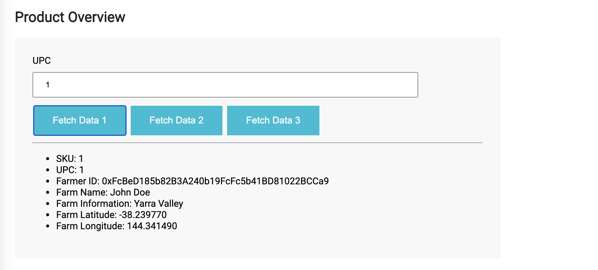
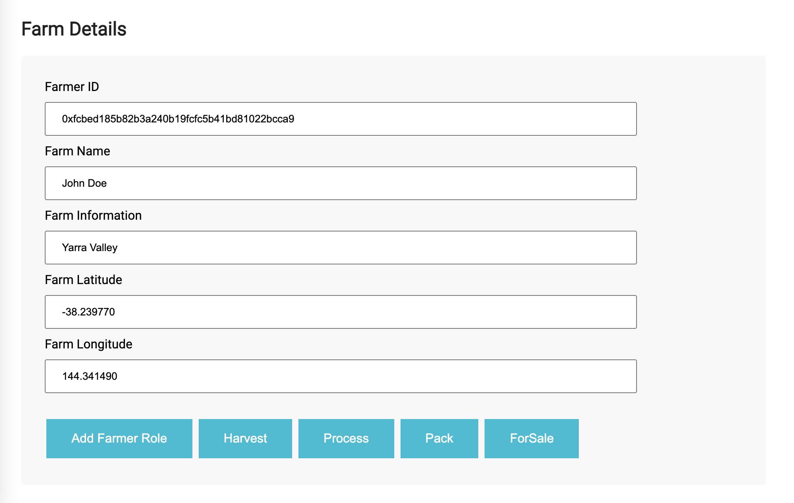
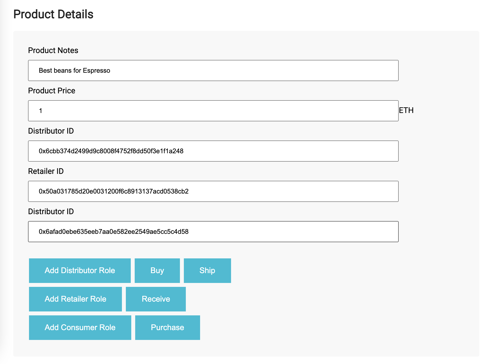
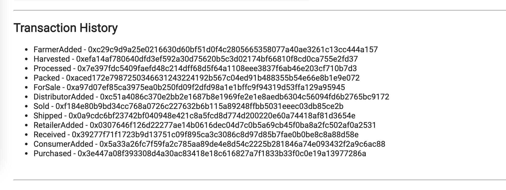

# Supply chain & data auditing

This repository containts an Ethereum DApp that demonstrates a Supply Chain flow between a Seller and Buyer. The user story is similar to any commonly used supply chain process. A Seller can add items to the inventory system stored in the blockchain. A Buyer can purchase such items from the inventory system. Additionally a Seller can mark an item as Shipped, and similarly a Buyer can mark an item as Received.

## Download and install

In order to test this application locally you need to download the source code and run the following commnads:

First clone this repository:

```
git clone https://github.com/javierftsp/coffeeSupplyChain-udacity-project3
```

Change directory to ```project-6``` folder and install all requisite npm packages (as listed in ```package.json```):

```
cd project-6
npm install
```

Launch Ganache:

```
ganache-cli -m "spirit supply whale amount human item harsh scare congress discover talent hamster"
```

Your terminal should look something like this:


In a separate terminal window, Compile smart contracts:

```
truffle compile
```

Your terminal should look something like this:


This will create the smart contract artifacts in folder ```build\contracts```.

Migrate smart contracts to the locally running blockchain, ganache-cli:

```
truffle migrate
```

Your terminal should look something like this:


Test smart contracts:

```
truffle test
```

All 10 tests should pass.


## Testing the DApp:

In a separate terminal window, launch the DApp:

```
npm run dev
```

after that open the following URL in your browser

```
http://localhost:3000/
```

You will found 4 forms that will allow you to interact with the contrat.

* Product Overview: here you enter the UPC number of the product you want to check the data and hit the Fetch Data buttons below.


* Farm Detail: from this form, you can add new products to the blockchain and complete the required actions for a farmer to sell coffee.
First, add the Farmer Role (if not added already) filling the "Farmer ID" field with an address from your Metamask accounts, and hit the "Add Farmer Role" button.
Then complete the rest of the Farm data and hit the "Harvest" button (this will add the product to the blockchain).
Finally complete the rest of the process by hitting the "Process", "Pack", and "ForSale" buttons in order.


* Product Detail: from this form, you can complete the rest of the process, passing the product from Farmer to Distributor, Retail and Customer:
First, add the Distributor Role (similar to Farmer Role). Then continue the Distributor process by hitting the "Buy", and "Ship" buttons.
Next, add the Retailer Role (same as Farmer Role) and hit the "Receive" button to mark the product as received.
Finally, add the Consumer Role (same as Farmer Role) and hit "Purchase" to change the ownership of the product and complete and complete the process.


* Transaction History: In this section, you will see the list of events emitted by the contract while using the DApp.



## Versions
* Truffle v5.4.8
* Solidity ^0.4.24
* Node v14.17.6
* Web3.js v1.5.2

## Rinkeby Contract Address
* transaction hash:    0x216dff6b01c1f984b56f9b366d000f9c49af17b92309e18654d4799413c223a3
* contract address:    0x66CfC8aec06C5617D634ed10D08a1651894Dacd9
